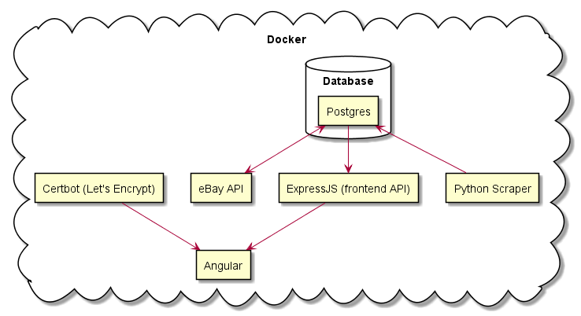

# GPUCompare-Dockerized

## Design



- Python to scrape GPU performance scores from 3DMark
- Rust to call eBay API for listings of each GPU, and sort all of the listings by *price/performance ratio*
- Express JS API to provide Angular with data from 
- Angular to run web server

## To be done

- Switch from json files to SQL/mongodb server queries
- Inter-container networking/volumes
	- API to become internal, then web server forwards requests?
	- Seems redundant
- Re-implement API
- Make rust script run as service
- Improve Angular build times
- Switch from dark to light mode
- Improve mobile experience
- Add easy to change environment variables for ports, domains, etc.

### Current issues

- api for website not updated for database access yet
    - Filters aren't implemented
- CORS issues on localhost (can switch to localho.st domain to bypass)

## Install

- Install **docker**
- Install **docker-compose**
- Add `.env` files to both `/local` and `/production` directories with the following contents:
	- (feel free to edit to your preferences, if its implemented right the values shouldnt effect functionality!)
	- Email address is only used in production for getting notifications from LetsEncrypt
	- EBAY_API_KEY must be obtained from https://developer.ebay.com, and will be your *App ID (Client ID)* - it's not a key/secret really, but probably not to be shared (eBay Developer Program ToS yada yada) 
```
DOMAIN_NAME=example.com
EMAIL_ADDRESS=me@example.com
EBAY_API_KEY=your_api_key
HTTP_PORT=80
HTTPS_PORT=443
API_PORT=60777
PGHOST=local_postgres
PGPORT=5432
PGDATABASE=gpucompare
PGUSER=postgres
PGPASSWORD=a
```
- Edit nginx.conf (probably just in production) to suit your deployment

> Example local config:

```
server {
    listen 80;
    #server_name localhost;
    return 301 https://localhost$request_uri;
}

server {
    listen 443 ssl;
    #server_name localhost;
    ssl_certificate /home/fullchain.pem;
    ssl_certificate_key /home/privkey.pem;

    location / {
        root /usr/share/nginx/html;
        index index.html;
    }
}
```

> Example production config

```
server {
    listen 80;
    server_name gpu.mhwdvs.com;
    return 301 https://gpu.mhwdvs.com$request_uri;
}

server {
    listen 443;
    server_name gpu.mhwdvs.com;
    ssl_certificate /home/fullchain.pem;
    ssl_certificate_key /home/privkey.pem;

    location / {
        root /usr/share/nginx/html;
        index index.html;
    }
}
```

### Development Environment
- `cd local && docker-compose up --build`

### Production Environment
- `cd production && docker-compose up -d`

### Postgres DB info

#### Tables

- gpulist: names of all gpus to be considered and their relative performance scores
- gpudb: ebay listings
- lastupdate: programatic UNIX EPOCH time of last time ebay listings were updated
    - May be redundant

### Potential changes

- Replace Express with SQL server
